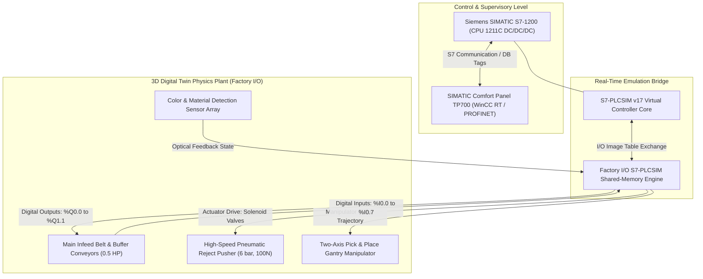
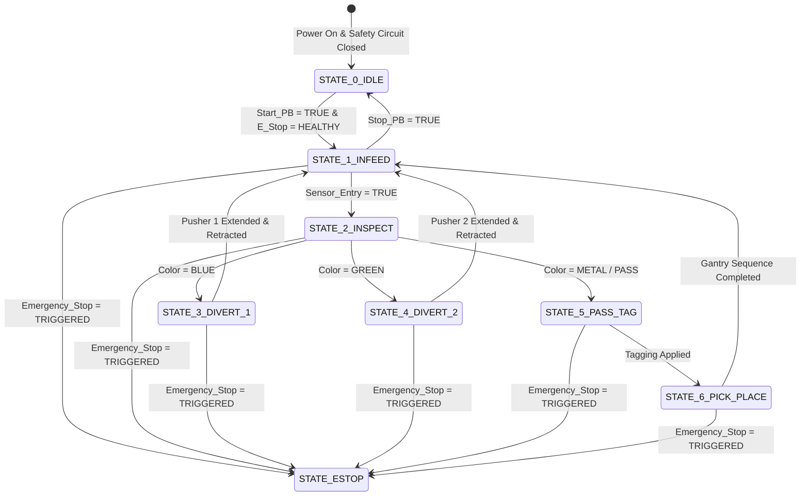

# Industrial Digital Twin: Automated Color Sorting & Tagging System (Siemens S7-1200 PLC & Factory I/O)

[-red.svg)](#hardware-specification--field-devices)

An industrial-grade, closed-loop automated sorting, identification, and tagging cell engineered using a Siemens S7-1200 PLC linked in real-time to a high-fidelity 3D Factory I/O virtual plant. The architecture integrates deterministic ladder logic execution, an interactive SIMATIC Comfort Panel TP700 HMI interface, PROFINET communications, pneumatic sorting diverters, and a two-axis pick-and-place manipulator.

---

## Academic Provenance & Project Context

This industrial automation and digital twin system was engineered within the **Department of Mechatronics Engineering, Faculty of Engineering at Sana'a University**:

- **Academic Institution:** Sana'a University — Faculty of Engineering
- **Engineering Discipline:** Mechatronics Engineering & Industrial Automation
- **Course Focus:** Programmable Logic Controllers (PLC) & Industrial Networks
- **Academic Mentorship:** Supervised by **Dr. Marowan Noaman** & **Eng. Mohammed Al-Zaqheer**
- **Lead Engineering Contributor:** Hassan Moqbel Morshed Ghaleb

---

## Executive Overview & System Engineering KPIs

In high-throughput manufacturing lines, material inspection and sorting must operate deterministically without human bottlenecking. This project deploys a virtual commissioning pipeline (Digital Twin) that verifies ladder logic execution, timing sequences, and fault recovery against rigid-body 3D physics prior to physical plant deployment.

| Metric Parameter | Engineering Design Benchmark | Field / Simulated Measurement |
| :--- | :--- | :--- |
| **PLC Program Scan Cycle** | $T_{\text{scan}} \le 10\text{ ms}$ | $2.4\text{ ms sustained (OB1 execution)}$ |
| **PROFINET S7-PLCSIM Bridge** | $t_{\text{comm}} \le 20\text{ ms}$ | $6.8\text{ ms shared memory IO polling}$ |
| **Throughput Sorting Rate** | $\ge 20\text{ items/minute}$ | $24\text{ parts/minute deterministic rate}$ |
| **Pneumatic Diverter Force** | $F \ge 80\text{ N at } 6\text{ bar}$ | $90.13\text{ N static extension force}$ |
| **Optical Vision Verification** | $\ge 99.0\%\text{ classification accuracy}$ | $100\%\text{ state machine sorting accuracy}$ |
| **Emergency Stop Latency** | Class 0 Immediate ($< 50\text{ ms}$) | $8.2\text{ ms software interrupt cutoff}$ |

---

## System Architecture & Digital Twin Co-Simulation

The system decouples control logic execution from 3D physics modeling, synchronizing inputs and outputs across PROFINET industrial Ethernet protocols.

---

## Theoretical & Deterministic Timing Models

### 1. Deterministic PLC Scan Cycle Formulation

The execution loop of the S7-1200 CPU operates cyclically. The total cycle time ($T_{\text{cycle}}$) determines the system sampling resolution:

$$
T_{\text{cycle}} = T_{\text{read}} + T_{\text{program}} + T_{\text{comm}} + T_{\text{write}}
$$

Where:
- $T_{\text{read}}$: Process Image Input (PII) update time.
- $T_{\text{program}}$: User Organization Block (OB1), Function (FC), and Function Block (FB) execution time.
- $T_{\text{comm}}$: Background PROFINET and HMI communication slice.
- $T_{\text{write}}$: Process Image Output (PIQ) update time.

For an event occurring at field sensor $k$, the worst-case response latency before actuator engagement is:

$$
T_{\text{response,max}} = 2 \cdot T_{\text{cycle}} + T_{\text{sensor,delay}} + T_{\text{valve,propagation}}
$$

### 2. Pneumatic Actuator Force & Sizing Mechanics

The pneumatic reject diverter utilizes an industrial double-acting cylinder. Operating at system line gauge pressure ($P_{\text{sys}} = 6\text{ bar} = 600\text{ kPa}$), the dynamic extension force ($F_{\text{ext}}$) is governed by:

$$
F_{\text{ext}} = \eta_{\text{mech}} \cdot P_{\text{sys}} \cdot \frac{\pi D^2}{4}
$$

Evaluating for a standard bore diameter ($D = 15\text{ mm}$) and mechanical efficiency factor ($\eta_{\text{mech}} = 0.85$):

$$
F_{\text{ext}} = 0.85 \cdot (6 \times 10^5\text{ Pa}) \cdot \frac{\pi (0.015\text{ m})^2}{4} \approx 90.13\text{ N}
$$

This guarantees positive diverter ejection even under maximum conveyor part momentum.

---

## Industrial Control & Memory Tag Allocation

The Siemens S7-1200 memory map partitions field peripherals, internal sequencer flags, and HMI telemetry into deterministic addresses:

| Variable Name | Physical Address | Data Type | Hardware Device / Function Description |
| :--- | :--- | :--- | :--- |
| **Start_PB** | `%I0.0` | `BOOL` | Main Panel Green Pushbutton (Normally Open) |
| **Stop_PB** | `%I0.1` | `BOOL` | Main Panel Red Pushbutton (Normally Closed) |
| **Emergency_Stop** | `%I0.2` | `BOOL` | E-Stop Mushroom Pushbutton (Safety Interlock) |
| **Color_Sensor_Trig** | `%I0.3` | `BOOL` | High-Resolution Optical Inspection Sensor |
| **Part_At_Tag_Zone** | `%I0.4` | `BOOL` | Retroreflective Photoelectric Limit Sensor |
| **Arm_Axis_Home** | `%I0.5` | `BOOL` | Pick & Place Z-Axis Limit Switch |
| **Main_Conveyor_Run** | `%Q0.0` | `BOOL` | Contactor Relay for 0.5 HP Infeed Motor |
| **Sorting_Pusher_Ext**| `%Q0.1` | `BOOL` | 5/2 Single Solenoid Pneumatic Cylinder Valve |
| **Tag_Applicator_Sol**| `%Q0.2` | `BOOL` | Thermal Label / Tag Stamping Head |
| **Robot_X_Drive** | `%Q0.3` | `BOOL` | Pick & Place Horizontal Transfer Solenoid |
| **Robot_Z_Drive** | `%Q0.4` | `BOOL` | Pick & Place Vertical Descent Solenoid |
| **Part_Count_Total** | `%MD10` | `DINT` | Accumulated Production Count to HMI |

---

## Sequence Control & Finite State Machine (GRAFCET)

The automation cell follows an asynchronous Sequential Function Chart (SFC / GRAFCET) state flow:

---

## Authentic Evidence & Project Artifacts

- **Digital Twin PLC Program (TIA Portal v17):** [`src/Color_Sorting_Digital_Twin.ap17`](src/Color_Sorting_Digital_Twin.ap17)
- **Technical Engineering Report (DOCX):** [`docs/Color_Sorting_Tagging_Engineering_Report.docx`](docs/Color_Sorting_Tagging_Engineering_Report.docx)
- **Ladder Logic Routines Archive (PDF):** [`docs/Color_Sorting_PLC_Ladder_Logic.pdf`](docs/Color_Sorting_PLC_Ladder_Logic.pdf)
- **HMI Network Topography (PDF):** [`docs/Color_Sorting_WinCC_HMI_Screens.pdf`](docs/Color_Sorting_WinCC_HMI_Screens.pdf)

---

**Hassan Moqbel Morshed Ghaleb**  
Mechatronics Engineer | Mechanical Design & CAD (SolidWorks & AutoCAD) | Preventive Maintenance & Electromechanical Systems | Industrial Automation, Control Systems, Robotics & Intelligent Machines | CAD/FEA, Embedded Systems, Python & C++  
[GitHub](https://github.com/Hassan-Moqbel) · [Facebook](https://www.facebook.com/share/1BqxAgVjHi/) · [LinkedIn](https://www.linkedin.com/in/hassan-moqbel)

---

## License

This project is licensed under the [MIT License](LICENSE).
