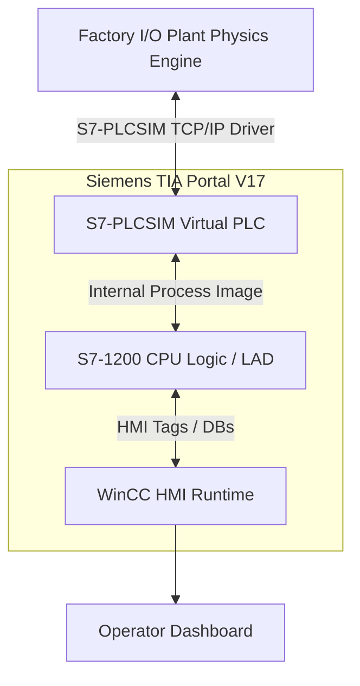

# Pneumatic Sorting System (PLC S7-1200 + Factory I/O)


-blue?style=for-the-badge)

## Executive Overview
Virtual Commissioning (Digital Twin methodology) is revolutionizing industrial automation by allowing engineers to validate PLC code against high-fidelity 3D physics engines prior to physical deployment. This project showcases the design, programming, and virtual commissioning of an **Electro-Pneumatic Sorting System**. Driven by a Siemens S7-1200 PLC, the system automatically tags, categorizes, and diverts workpieces based on real-time visual sensor logic within the Factory I/O environment, fully monitored via an interactive WinCC Human-Machine Interface (HMI).

> [!WARNING]
> **Industrial Safety Callout**
> This logic implements high-force pneumatic actuators (pushers/stampers). In a real-world deployment, these represent severe crush and pinch zones. The Ladder Logic explicitly includes Emergency Stop (E-Stop) interrupts (Normally Closed architecture) to instantly depressurize the solenoid valves. Operators must adhere to LOTO (Lockout/Tagout) procedures before physically crossing the sensor barriers.

## System Highlights
- **Digital Twin Virtual Commissioning**: Complete physical emulation of gravity, conveyor friction, and pneumatic strokes via Factory I/O.
- **Color-Based Workpiece Routing**: Vision sensors tied to discrete PLC tags automatically route blue, green, and metal parts into segregated gravity chutes.
- **Electro-Pneumatic Stamping**: Automated tagging cylinder sequence with debounce-protected limit switches for stroke confirmation.
- **WinCC HMI Telemetry**: Real-time production counting, system states, and manual override capabilities integrated into a Siemens HMI panel.

## System Architecture & Industrial Network Topology



## Automation Theory & Mathematical Model

### PLC Deterministic Scan Cycle
The Siemens S7-1200 operates on a strict cyclic execution model, ensuring deterministic control. The total scan time $T_{scan}$ is modeled as:
$$ T_{scan} = T_{read} + T_{exec} + T_{comm} + T_{write} $$
Where:
- $T_{read}$: Time to read physical inputs to the Process Image Input (PII) table.
- $T_{exec}$: Execution time of the Ladder Logic (OB1 main sweep).
- $T_{comm}$: Time allocated for HMI communication and diagnostics.
- $T_{write}$: Time to flush the Process Image Output (PIQ) table to the physical actuators.

### Electro-Pneumatic Sequencing Logic
Actuator firing relies on a boolean state matrix preventing collisions. For instance, the Pusher Solenoid ($Q_{push}$) is driven by:
$$ Q_{push} = S_{color} \land S_{position} \land \neg E_{stop} \land \neg T_{debounce} $$
Where $T_{debounce}$ represents an IEC timer (TON) masking sensor noise.

## PLC Tag & I/O Allocation Table
*Extract from the original TIA Portal Symbol Table.*

| Tag Name | Address | Data Type | Description / Hardware |
| :--- | :--- | :--- | :--- |
| **System_Start** | `%I0.0` | `Bool` | NO Start Pushbutton |
| **System_Stop** | `%I0.1` | `Bool` | NC Stop Pushbutton |
| **Emergency_Stop** | `%I0.2` | `Bool` | NC Mushroom E-Stop Button |
| **Sensor_Entry** | `%I0.3` | `Bool` | Diffuse Photoelectric Sensor |
| **Vision_Color_Blue** | `%I0.4` | `Bool` | Vision Sensor (Blue Filter) |
| **Vision_Color_Green** | `%I0.5` | `Bool` | Vision Sensor (Green Filter) |
| **Conveyor_Motor** | `%Q0.0` | `Bool` | Main Conveyor Contactor (K1) |
| **Stamper_Cyl_Extend** | `%Q0.1` | `Bool` | 5/2 Solenoid Valve (Tagging) |
| **Pusher_1_Extend** | `%Q0.2` | `Bool` | Pneumatic Diverter 1 |
| **Pusher_2_Extend** | `%Q0.3` | `Bool` | Pneumatic Diverter 2 |

## Repository Layout Tree
```text
.
├── docs/                  # Original academic reports, Ladder Logic PDFs, and HMI designs
├── media/                 # Original video demonstrations of the Digital Twin in action
├── simulation/            # Factory I/O virtual plant scene files (.factoryio)
├── src/                   # Source Siemens TIA Portal V17 Project (.ap17)
└── _archive/              # Redundant draft documents
```

## Digital Twin Commissioning Guide
1. **Prerequisites**: Install Siemens TIA Portal V17, S7-PLCSIM V17, and Factory I/O.
2. **Open PLC Project**: Navigate to `src/` and open `hassn_and_musa.ap17` in TIA Portal.
3. **Start Simulation**: Click the `Start Simulation` icon in the TIA Portal toolbar to launch S7-PLCSIM. Load the hardware configuration and logic into the virtual CPU.
4. **Launch Factory I/O**: Open `simulation/Factory io tags.factoryio`.
5. **Bind Driver**: Go to `File > Drivers` in Factory I/O. Select **Siemens S7-PLCSIM**, configure the IP parameters, and click **Connect**.
6. **Execute**: Start the Factory I/O simulation and use the virtual HMI or hardware pushbuttons to run the plant.

## Authentic Assets & Media Catalog
- **Source Logic PDF**: [`docs/Tags PLC code.pdf`](docs/Tags%20PLC%20code.pdf) **[ORIGINAL ASSET]**
- **HMI Interface Screens**: [`docs/Tags ΗΜΙ screen.pdf`](docs/Tags%20ΗΜΙ%20screen.pdf) **[ORIGINAL ASSET]**
- **Video Demonstrations**: Located in the `media/` directory as definitive proof of successful Virtual Commissioning **[ORIGINAL VIDEO DEMO]**.

## Engineering Audit & Defensibility Limitations
- **Virtual vs. Physical Impedance**: While Factory I/O brilliantly simulates spatial kinematics and boolean logic, it cannot simulate real-world pneumatic pressure drops, compressor flow rates (CFM), or stiction in the cylinder seals. In a real deployment, proportional flow-control valves would need manual physical tuning to prevent the pushers from launching the workpieces off the conveyor belt.
- **Network Latency**: The S7-PLCSIM interface runs over localhost TCP/IP. Industrial PROFINET networks rely on strict deterministic hardware routing (Isochronous Real-Time) to achieve sub-millisecond latencies, which cannot be accurately profiled in this software-only digital twin.

---

**Hassan Moqbel Morshed Ghaleb**
Mechatronics Engineer | Mechanical Design & CAD (SolidWorks & AutoCAD) | Preventive Maintenance & Electromechanical Systems | Industrial Automation, Control Systems, Robotics & Intelligent Machines | CAD/FEA, Embedded Systems, Python & C++
[GitHub](https://github.com/Hassan-Moqbel) · [Facebook](https://www.facebook.com/share/1BqxAgVjHi/) · [LinkedIn](https://www.linkedin.com/in/hassan-moqbel)

## License
This project is licensed under the [MIT License](LICENSE).
